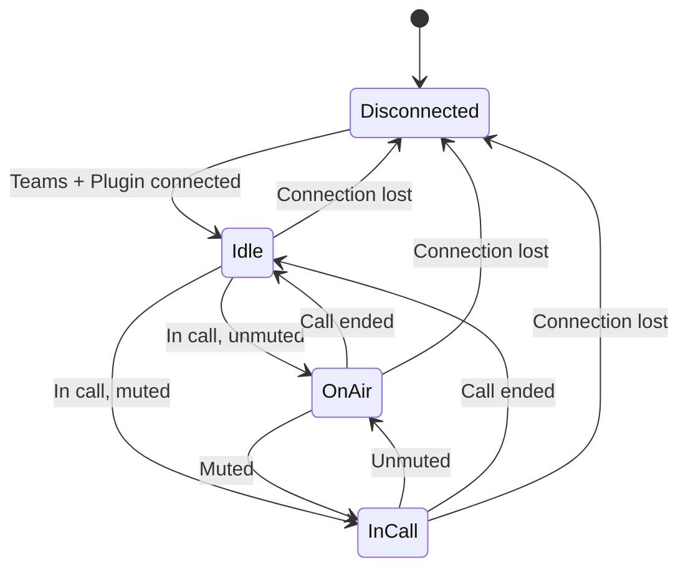
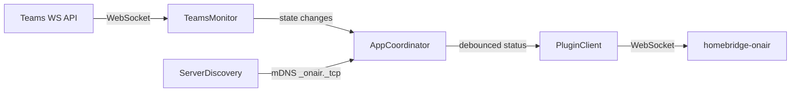

# OnAir Companion

A macOS menubar companion app for [homebridge-onair](https://github.com/alampros/homebridge-onair). It monitors your Microsoft Teams meeting status in real time and forwards it to the homebridge-onair plugin, which can drive HomeKit accessories (lights, signs, etc.) to show your on-air state.

## Prerequisites

- **macOS 26+** (Tahoe) with Xcode installed
- **Microsoft Teams** desktop app with the Third-Party API enabled:
  1. Open Teams → **Settings** → **Privacy**
  2. Scroll to **Manage API**
  3. Toggle **Enable API** on
- A running [homebridge-onair](https://github.com/alampros/homebridge-onair) plugin instance on your local network

## Build

Open the project in Xcode and build, or from the command line:

```
xcodebuild -project OnAirCompanion.xcodeproj -scheme OnAirCompanion build
```

## Configuration

On first launch the app appears as a menubar icon. Open **Settings** (right-click the icon or use ⌘,) to configure:

| Setting | Required | Description |
|---------|----------|-------------|
| **Occupant ID** | Yes | Must match the occupant ID configured in your homebridge-onair plugin. This identifies which occupant's on-air state to control. |
| **Plugin URI** | No | Manually specify the plugin WebSocket address (e.g. `ws://192.168.1.50:18440`). When blank, the app discovers the plugin automatically via mDNS. |
| **Launch at Login** | No | Start OnAir Companion automatically when you log in. |

On first launch Teams will prompt you to allow the third-party device connection — accept the prompt. You can re-pair later from Settings.

## How It Works

OnAir Companion maintains two WebSocket connections and an mDNS browser:

1. **TeamsMonitor** connects to the Teams local WebSocket API (`ws://127.0.0.1:8124`) and receives real-time meeting state updates (in-call, muted).
2. **ServerDiscovery** uses Bonjour/mDNS to find homebridge-onair instances advertising `_onair._tcp` on the local network (or uses the manual Plugin URI).
3. **PluginClient** connects to the discovered plugin and sends status updates whenever the Teams state changes.
4. **AppCoordinator** ties everything together — it observes Teams state, debounces rapid changes, and forwards the result to the plugin. It also handles system sleep/wake (disconnects before sleep, reconnects on wake) and network changes (restarts mDNS browsing when connectivity changes).





## License

See [LICENSE](LICENSE) for details.
