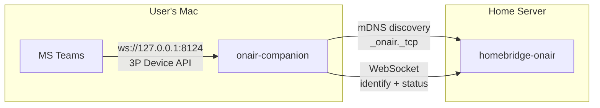
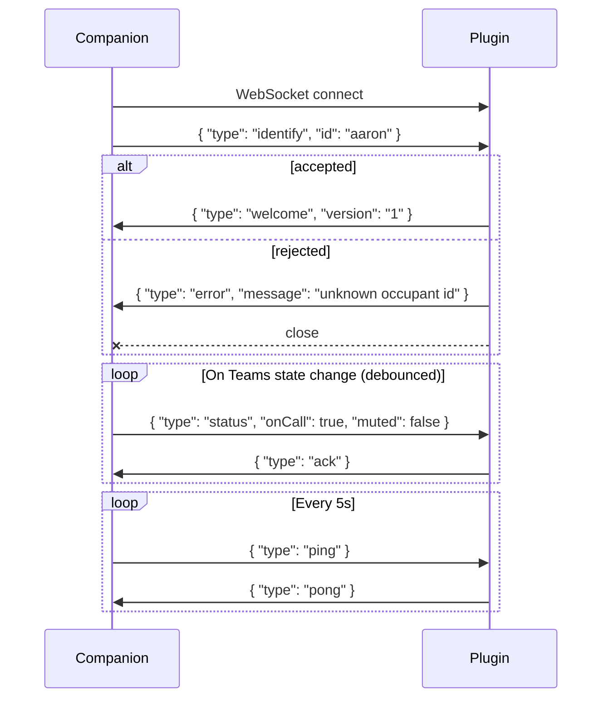
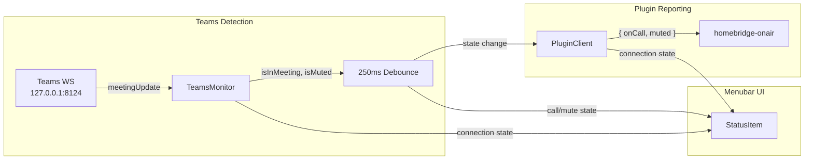

# onair-companion — Architecture & Implementation Plan

## Overview

`onair-companion` is a macOS menubar app (Swift) that detects Microsoft Teams call and mute status via the Teams 3rd Party Device API and reports it to a `homebridge-onair` plugin over WebSocket. It is a lightweight, always-running agent — no dock icon, no main window, just a menubar presence.

Each user's Mac runs one instance. Multiple instances (one per household member) connect to the same Homebridge plugin, each identifying as a different configured occupant.

## System Context



## Teams 3rd Party Device API

The companion talks to Teams via a **local WebSocket** — not a REST API, not a log file, not the Graph API. Teams runs a WebSocket server on the local machine that pushes meeting state in real time.

### Connection Details

| Property | Value |
|----------|-------|
| Endpoint | `ws://127.0.0.1:8124/` |
| Transport | WebSocket (HTTP upgrade) |
| Direction | Teams is the server, companion is the client |
| Push model | Teams pushes state changes; no polling required |
| IPv4 only | Must use `127.0.0.1`, NOT `localhost` (Teams does not bind to `::1`) |

### Authentication / Pairing

Pairing data is sent as **query parameters on the WebSocket upgrade URL**:

```
ws://127.0.0.1:8124/?protocol-version=2.0.0&token=<token>&manufacturer=alampros&device=macOS&app=OnAirCompanion&app-version=1.0.0
```

| Parameter | Value | Notes |
|-----------|-------|-------|
| `protocol-version` | `"2.0.0"` | Exact value required — Teams rejects anything else |
| `token` | `""` or stored token | Empty string triggers a pairing prompt in Teams UI |
| `manufacturer` | `"alampros"` | Identifies the app author |
| `device` | `"macOS"` | Device type |
| `app` | `"OnAirCompanion"` | App name |
| `app-version` | `"1.0.0"` | App version |

All six parameters are mandatory. Missing any causes Teams to close the connection (code 1006).

**Token lifecycle:**
1. First connection: send empty `token`. Teams shows Allow/Block prompt to the user.
2. User clicks Allow: Teams sends a JSON message with the token. Store it persistently.
3. Subsequent connections: send stored token. Teams accepts silently.
4. User revokes via Teams Settings > Privacy > Manage API: token becomes invalid. Clear it and restart pairing.

**User prerequisite:** Teams > Settings > Privacy > "Manage API" > "Enable API" must be ON. If grayed out, the org's IT admin has disabled it via policy — no workaround.

### Inbound Messages (Teams -> Companion)

All messages are JSON text frames. Two types:

#### Meeting State Update

```json
{
    "apiVersion": "2.0.0",
    "meetingUpdate": {
        "meetingState": {
            "isInMeeting": true,
            "isMuted": false,
            "isVideoOn": true,
            "isHandRaised": false,
            "isInLargeGallery": false,
            "isBackgroundBlurred": false,
            "isSharing": false,
            "hasUnreadMessages": false,
            "isRecordingOn": false
        },
        "meetingPermissions": {
            "canToggleMute": true,
            "canToggleVideo": true,
            "canToggleHand": true,
            "canToggleBlur": true,
            "canLeave": true,
            "canReact": true,
            "canToggleShareTray": true,
            "canToggleChat": true,
            "canStopSharing": true,
            "canPair": true
        }
    }
}
```

Only `isInMeeting` and `isMuted` are needed for OnAir. Everything else can be parsed but ignored. Teams may also send updates with only `meetingPermissions` and no `meetingState` — handle gracefully.

#### Pairing Response (token delivery)

```json
{
    "tokenRefresh": "abc123..."
}
```

May arrive as `"token"` or `"tokenRefresh"`. Prefer `tokenRefresh` if present.

### Outbound Commands (Companion -> Teams)

Not needed for the companion's core purpose, but the API supports:

```json
{ "action": "toggle-mute", "requestId": 1, "parameters": {} }
```

We may want `toggle-mute` for a future "mute from menubar" feature, but it is out of scope for v1.

### Timing Considerations

- Teams sends 2-4 rapid `meetingUpdate` messages for a single user action (e.g., joining a call). A **250ms debounce** on state changes before forwarding to Homebridge prevents unnecessary WebSocket traffic.
- The WebSocket is fully push-based — no polling interval to configure.

## Homebridge Plugin Protocol (v1)

The companion connects to the Homebridge plugin as a WebSocket client. Full protocol spec lives in `homebridge-onair/docs/PLAN.md`. Summary here for implementer reference.

### Discovery

1. Browse mDNS for `_onair._tcp` using `NWBrowser` (Network framework)
2. On discovery, extract host and port from the resolved endpoint
3. Fallback: user enters a URI manually in Settings (stored in UserDefaults)

### Connection Lifecycle



### Message Types (Client -> Server)

| type | fields | description |
|------|--------|-------------|
| `identify` | `id: string` | First message after connect. Must match a configured occupant ID in the plugin. |
| `status` | `onCall: bool, muted: bool` | Teams state. Sent on every debounced state change. |
| `ping` | — | Heartbeat. Sent every 5 seconds. |

### Reconnection

On disconnect from the plugin, reconnect with exponential backoff: 1s, 2s, 4s, 8s, 16s, capped at 30s. Reset to 1s on successful connection.

## State Flow



Two independent WebSocket connections are maintained simultaneously:
1. **Inbound:** Teams local WS (127.0.0.1:8124) — receives meeting state
2. **Outbound:** Plugin WS (discovered via mDNS or manual URI) — sends status reports

These are fully independent — the app should handle either being down without affecting the other. If Teams is disconnected, report `onCall: false` to the plugin. If the plugin is disconnected, keep tracking Teams state so it's immediately available when the plugin reconnects.

## Menubar UI

No dock icon, no main window. Menubar only.

### Icon States

| State | Icon | Tooltip |
|-------|------|---------|
| Not connected to Teams or plugin | Gray/dim indicator | "OnAir: Disconnected" |
| Connected, not in a call | Neutral indicator | "OnAir: Idle" |
| In a call, muted | Yellow/amber indicator | "OnAir: In Call (Muted)" |
| In a call, unmuted | Red indicator | "OnAir: On Air" |

### Menu Items

```
┌──────────────────────────────┐
│ Status: On Air               │  (non-interactive, shows current state)
│ ─────────────────────────── │
│ Teams: Connected             │  (non-interactive)
│ Plugin: Connected (Aaron)    │  (non-interactive, shows occupant ID)
│ ─────────────────────────── │
│ Settings...                  │  (opens settings popover/window)
│ Quit OnAir Companion         │
└──────────────────────────────┘
```

### Settings

| Setting | Storage | Default | Notes |
|---------|---------|---------|-------|
| Occupant ID | UserDefaults | `""` | Required. Must match plugin config. |
| Plugin URI | UserDefaults | `""` | Manual override. Empty = use mDNS discovery. |
| Launch at Login | SMAppService | off | Standard macOS launch-at-login via SMAppService |
| Teams Pairing Token | UserDefaults | `""` | Auto-managed. Show a "Re-pair" button to clear it. |

## Project Structure

```
onair-companion/
├── OnAirCompanion/
│   ├── OnAirCompanionApp.swift          # @main, menubar-only app lifecycle
│   ├── Services/
│   │   ├── TeamsMonitor.swift           # WebSocket client to Teams local API
│   │   ├── PluginClient.swift           # WebSocket client to homebridge-onair
│   │   ├── ServerDiscovery.swift        # NWBrowser for _onair._tcp + fallback
│   │   └── AppCoordinator.swift         # Glue: Teams state -> Plugin reporting
│   ├── Models/
│   │   ├── TeamsMessage.swift           # Codable types for Teams JSON protocol
│   │   ├── PluginMessage.swift          # Codable types for plugin WS protocol
│   │   └── AppState.swift              # Observable app-wide state
│   ├── Views/
│   │   ├── MenuBarView.swift            # NSMenu for the status item
│   │   ├── SettingsView.swift           # Settings popover or window
│   │   └── StatusItemController.swift   # Manages NSStatusItem icon/tooltip
│   └── Utilities/
│       └── Debouncer.swift              # 250ms debounce for Teams state bursts
├── OnAirCompanion.xcodeproj
├── docs/
│   └── PLAN.md                          # This file
├── AGENTS.md
└── README.md
```

## Dependencies

**None.** The app uses only Apple frameworks:

| Framework | Purpose |
|-----------|---------|
| SwiftUI | Settings view |
| AppKit | NSStatusItem, NSMenu |
| Foundation | URLSessionWebSocketTask (Teams connection), JSONDecoder/Encoder |
| Network | NWBrowser for mDNS discovery |
| ServiceManagement | SMAppService for launch-at-login |

Zero third-party dependencies. `URLSessionWebSocketTask` handles both WebSocket connections (Teams and plugin).

## Implementation Phases

### Phase 1: Scaffold

- Create Xcode project: macOS App, SwiftUI lifecycle
- Configure as menubar-only (LSUIElement = YES, no main window)
- Basic NSStatusItem with a static icon and placeholder menu
- Project structure: Services/, Models/, Views/, Utilities/ groups

### Phase 2: Teams Integration

- Port `TeamsMessage.swift` models from OnAir (Codable types for meetingUpdate, pairing)
- Implement `TeamsMonitor` — WebSocket client to `ws://127.0.0.1:8124/`
  - Query-parameter-based pairing handshake
  - Token storage in UserDefaults
  - Receive loop parsing meetingUpdate messages
  - Reconnection with exponential backoff (1s -> 30s cap)
  - Published state: `connectionState`, `isInCall`, `isMuted`
- Implement `Debouncer` (250ms)

### Phase 3: Plugin Client

- Implement `PluginMessage.swift` — Codable types for plugin WebSocket protocol (identify, status, ping, etc.)
- Implement `PluginClient` — WebSocket client to the Homebridge plugin
  - Connect to discovered or manually-configured URI
  - Send `identify` with configured occupant ID
  - Send `status` on debounced Teams state changes
  - Send `ping` every 5 seconds via a Timer
  - Handle `welcome`, `ack`, `pong`, `error` responses
  - Reconnection with exponential backoff
  - Published state: `connectionState`

### Phase 4: Service Discovery

- Implement `ServerDiscovery` using `NWBrowser`
  - Browse for `_onair._tcp`
  - Resolve to host:port
  - Fallback to manual URI from UserDefaults
  - Published state: list of discovered servers, selected server

### Phase 5: App Coordinator

- Implement `AppCoordinator` — the glue layer
  - Observes `TeamsMonitor` state changes
  - Debounces and forwards to `PluginClient` as `status` messages
  - Derives combined app state for the UI (disconnected / idle / in-call / on-air)
  - Handles edge cases:
    - Teams disconnects -> send `onCall: false` to plugin
    - Plugin disconnects -> keep tracking Teams, send immediately on reconnect
    - App launch sequence: start Teams monitor + discovery in parallel

### Phase 6: Menubar UI

- Implement `StatusItemController`
  - Icon changes based on app state (gray / neutral / amber / red)
  - Tooltip updates
- Implement `MenuBarView` — NSMenu with status lines + Settings + Quit
- Implement `SettingsView`
  - Occupant ID text field (required)
  - Plugin URI text field (optional, overrides mDNS)
  - Launch at Login toggle (SMAppService)
  - Re-pair Teams button (clears stored token)

### Phase 7: Polish

- Launch-at-login via SMAppService
- Graceful shutdown: disconnect both WebSockets cleanly on quit
- Handle macOS sleep/wake: reconnect both WebSockets on wake
- Handle network changes: re-trigger mDNS browse on network change
- App icon and menubar icon assets
- README with setup instructions

## Porting Notes from OnAir

Code to reference in `/Users/alampros/Projects/OnAir/src/OnAir/`:

| Existing File | What to Port | Notes |
|---------------|-------------|-------|
| `Models/TeamsMessage.swift` | All Codable types | Can be copied nearly verbatim |
| `Services/TeamsClient.swift` | WebSocket connection, pairing, receive loop | Refactor into `TeamsMonitor`; strip out light-control logic |
| `Utilities/Debouncer.swift` | Debounce utility | Copy as-is |
| `Services/OnAirCoordinator.swift` | State-to-action mapping | Replace light logic with plugin reporting |

Key differences from OnAir:
- OnAir controls a light directly; companion reports state to a Homebridge plugin
- OnAir has one WebSocket (Teams); companion has two (Teams + plugin)
- OnAir derives a binary on/off; companion reports `onCall` + `muted` separately for the additive sensor model
